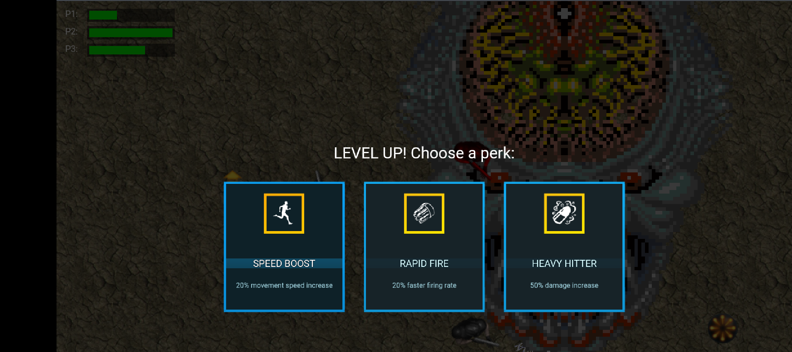

# Sh'M↑ Party — PlayStation 2



Twin-stick survival shooter, ported from
[shmup-party-sp](https://github.com/easierbycode/shmup-party-sp) (Svelte 5 +
Phaser 4) to [5velte-ps2](https://github.com/easierbycode/svelte-ps2) — the
AthenaEnv v4 compatibility layer. **One JS codebase, two targets:**

- **Real PS2 / PCSX2 / Play!** — [`ps2/`](ps2/) is a complete
  [AthenaEnv](https://github.com/DanielSant0s/AthenaEnv) app (athena.elf +
  `main.js` + assets) packaged into a bootable ISO9660 image.
- **Browser** — the same `ps2/` modules run unmodified on Phaser 4 via
  5velte-ps2's host: [`src/web/ps2-scene.ts`](src/web/ps2-scene.ts) installs
  AthenaEnv's globals (`Screen`, `Draw`, `Image`, `Pads`, …), imports
  `ps2/main.js`, and ticks the runtime every frame.

Download page + browser build + ISO deploy to
**<https://easierbycode.com/shmup-party-ps2/>** on every push to `main`
([.github/workflows/deploy.yml](.github/workflows/deploy.yml)).

## Run

```sh
npm install
npm run dev        # browser build at http://localhost:5173/play/
npm run build      # production build (base /shmup-party-ps2/)
npm run iso        # deno-powered ISO9660 writer -> shmup-party-ps2.iso
npm run assets     # regenerate ps2/assets from ../shmup-party-sp art + sfx (PIL, ffmpeg)
```

The ISO boots in PCSX2, in the CMG launcher's PlayStation 2 screen (the
Play! WASM emulator), and on softmodded hardware (OPL / DVD-R).

## Controls

- **Left stick / d-pad** move · **right stick** aim + fire (twin-stick)
- **CROSS** auto-aim fire (for pads with no right stick — and the keyboard)
- **L1** barrier dash · **R1** cycle weapon (ION / CIGA / PAC)
- **START** pause · **SELECT** restart run
- Keyboard: arrows/WASD move, SPACE fire, Q dash, E weapon, ENTER start,
  SHIFT restart
- Player slots wear different rigs: **P1** is Duke (shmup-party-phaser4's
  attract hero), **P2** the classic trooper, **P3/P4** blue/green trooper
  recolors

## Demo mode

Leave the title alone for ten seconds and it rolls the Crimsonland demo
reel — the menu and upsell demos from the Android rip's `demos.xml`
([`ps2/data/demos.js`](ps2/data/demos.js), generated by
[`scripts/prep-demos.py`](scripts/prep-demos.py)), played in order by
AI troopers with each node's scripted spots, weapons, spawns and duration.
Press **L1+R1** (keyboard **Q+E**) on the demo screen to grab **Player 2**
and play inside the rolling reel; **START** returns to the title.

## Global leaderboard (SpacetimeDB)

Survival runs post to a global leaderboard backed by
[SpacetimeDB](https://spacetimedb.com) — database `shmup-party-leaderboard`
on maincloud ([dashboard](https://spacetimedb.com/shmup-party-leaderboard)).
Every kill scores its Crimsonland `experience_worth` (creature-variants.xml),
carried per enemy/variant as `score` in
[`ps2/data/tuning.js`](ps2/data/tuning.js); on game over an arcade
initials screen ([`ps2/screens/gameover.js`](ps2/screens/gameover.js))
submits the run and shows the global top 10, and the title screen shows the
top 3.

[`ps2/lib/leaderboard.js`](ps2/lib/leaderboard.js) speaks SpacetimeDB's
HTTP API on both targets: `fetch` in the browser, AthenaEnv's `Network` +
`Request` (TLS 1.2) on real hardware, and it degrades to an OFFLINE board
when neither can reach the host. The server module lives in
[`spacetimedb/`](spacetimedb/) (TypeScript): one public `score` table the
`submit_score` reducer trims to the global top 100, so clients read it with
one-off SQL and sort client-side. Deploy changes with:

```sh
cd spacetimedb/spacetimedb
npm install
spacetime publish        # database + server from ../spacetime*.json
```

`LEADERBOARD` in `ps2/data/tuning.js` picks the host + database — point it
at `http://127.0.0.1:3000` (`spacetime start` + `spacetime publish --server
local`) to develop against a local instance.

## Porting notes

AthenaEnv's `Image` has crops + flips but **no rotation**, and the GS tops
out at 1024px textures — so [`scripts/prep-assets.py`](scripts/prep-assets.py)
pre-rotates the player ship and ion bolt into 16-direction sheets, repacks
the 64-frame zombie/alien atlases into 8-frame strips, rasterizes a Share
Tech Mono bitmap-font grid (one text path for both targets), and composes
the 640x448 background. Frame metadata lands in the generated
[`ps2/data/sheets.js`](ps2/data/sheets.js).

Waves, perks, powerups, the barrier dash and the Evil Brain boss are ported
from the Phaser original's scenes/game-objects, retuned for a single-screen
640x448 arena (the original plays on a 1680x1050 scrolling world).

Sfx come from the original's `assets/sfx` mp3 pack, the Crimsonland rip's own
`sfx` folder, and `scripts/sfx` for one-offs (PAC fires the arcade coin
jingle), converted by
`prep-assets.py` into audsrv ADPCM (`.adp`, played through AthenaEnv's
`Sound.Sfx` — `audsrv = true` in [`ps2/athena.ini`](ps2/athena.ini)) plus a
`.wav` twin the browser build plays through a Phaser-backed `Sound` shim
([`src/web/sound-shim.ts`](src/web/sound-shim.ts)).
[`ps2/lib/audio.js`](ps2/lib/audio.js) owns the bank, volumes and the
per-effect spam throttle; every call no-ops on hosts without the Sound API.
Death splats get their own pair of takes, alternated so a kill streak doesn't
sound like one sample stuttering.
